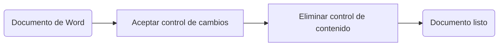
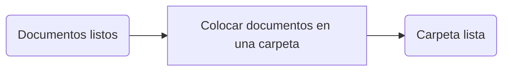
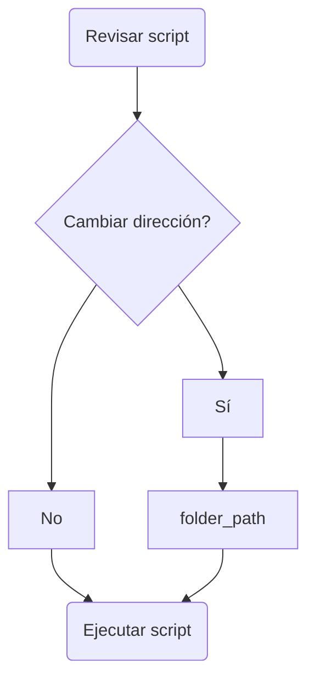

# Introducción
Para la transcripción de las entrevistas, partimos del [protocolo de Historia Oral versión 2022 de la Columbia University](https://static1.squarespace.com/static/575a10ba27d4bd5d7300a207/t/621cf621281bcd63d23a3dde/1646065186028/CCOHR+Transcript+Style+Guide+2022.pdf), sobre el cual hicimos unas modificaciones para llegar a [nuestro propio protocolo](https://github.com/Omphalos99/histo-internet-col/blob/main/_entrevistas/Protocolo_entrevistas.md). Para la transcripción, utilizamos el software xxx. A partir lo que este generó, hicimos correcciones manuales utilizando la herramienta de control de cambios de Microsoft Word.
Además hicimos etiquetado de entidades, para interpretar las entrevistas a partir de metodologías digitales como la lectura a distancia. Todas las palabras o frases que estén encerradas entre asteriscos "* *" son entidades que etiquetamos.

# Extracción de entidades
El primer flujo metodológico digital con las entrevistas consistió en la extracción y conteo de las entidades codificadas manualmente. Estas se depositaron en dos documentos en formato csv, "conteo_global_de_conceptos" y "conteo_conceptos_archivo". En el primer csv, hay dos columnas: "concept" (entidad) y "count" (conteo). Estas dan cuenta de todas las entidades codificadas en todas las entrevistas y cuántas veces aparecen en total. En el segundo csv, hay tres columnas: "file" (archivo), "concept" (entidad) y "count" (conteo). Estas muestran cuáles entidades aparecen en cada entrevista y cuántas veces aparecen en esa entrevista.

Para realizar esta extracción de entidades a partir de un documento de Word con control de cambios, es necesario seguir una serie de pasos.

1. Preparación del documento Word

2. Preparación de carpeta con documentos listos

3. Ejecutar scripts de Python

